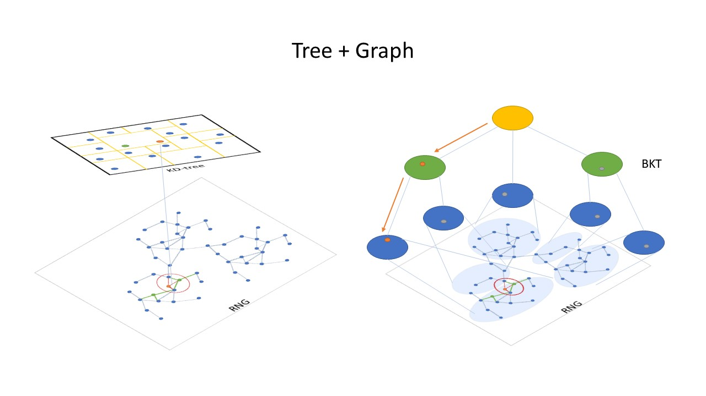
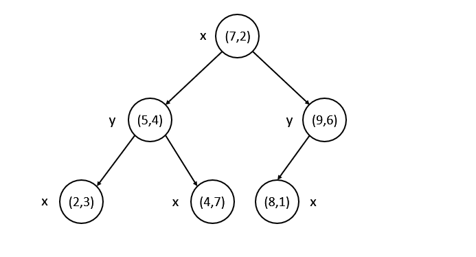
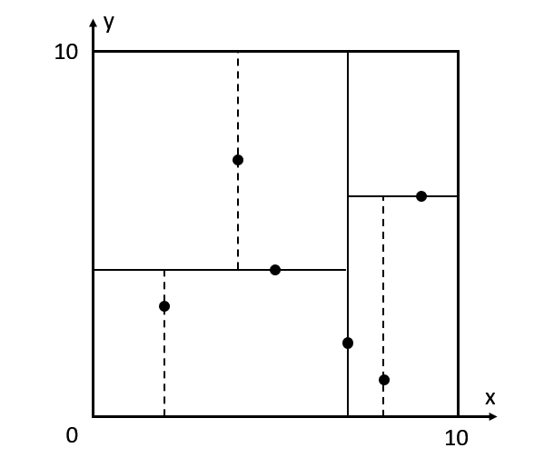
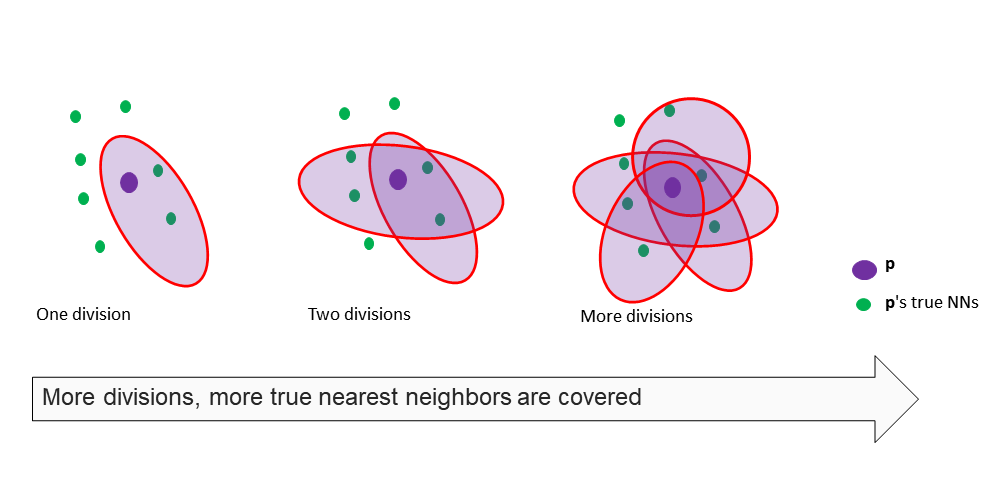
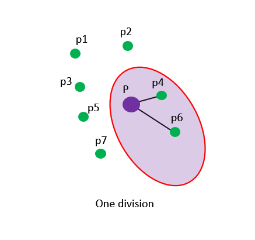
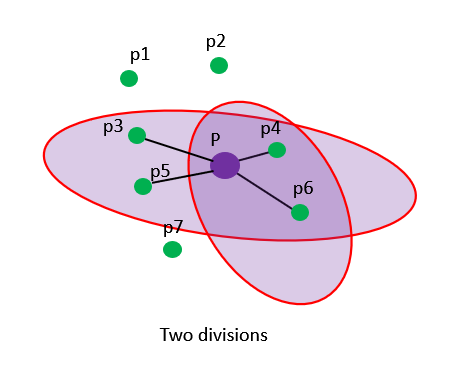
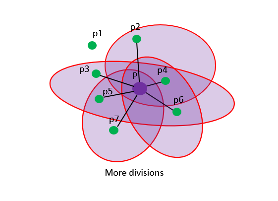
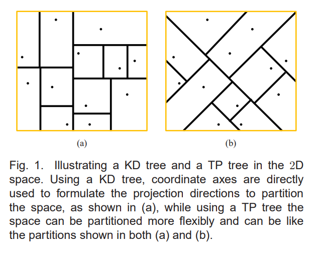
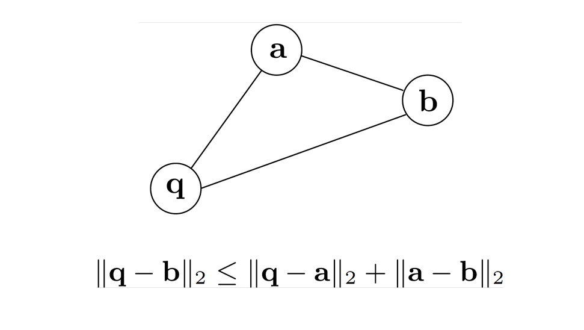

Copyright © Microsoft Corporation. All rights reserved.
  适用于[License](https://github.com/Microsoft/ai-edu/blob/master/LICENSE.md)版权许可
  

# 基于近邻图的向量搜索
约一年前，微软开源了一种基于近邻图的向量搜索算法[SPTAG](https://github.com/microsoft/SPTAG)，该算法能够在大规模向量中快速搜索最近邻，并应用于[Microsoft Bing](https://bing.com)中。我们将在此案例中介绍该搜索算法。

# 案例介绍

## 最近邻问题
SPTAG解决的问题是如何从大规模的向量中快速找出近似最近邻点（Approximate Nearest Neighbor），即实现**最近邻搜索（Nearest Neighbor Search）**。

我们可以将问题定义为：

其中，q为查询向量，x为样本向量，我们可以计算它们的L2或余弦距离，获得两者距离最近的样本。

该问题最早是在1973年由高德纳在《计算机程序设计艺术》中提到，并称之为邮局问题，即居民寻找离自己家最近的邮局。

要实现这个目标，有以下几种常见的最近邻搜索算法:

1. 线性查找

   线性查找通过遍历计算点集的距离，从而找出距离最小的样本。该方法的时间复杂度为O(nd)，n为样本数，d为样本的维度数，当数据量达到一定规模后，该方法的搜索时间将会变得难以接受。为了解决该问题，又有人提出了利用空间划分树来提高搜索效率。

2. 空间划分树
   
   空间划分树常用的是KD-Tree（于1970s提出）。其算法是通过递归地选取K维作为结点划分依据，将样本划分成左子树和右子树，最终生成一棵二叉树索引。这类方法的搜索效率通常对于低维度的数据效果比较好（如小于100维），但对于高维数据效果较差。而图片的向量表示通常能够达到1000维甚至更多。

由于KDTree在高维向量空间上的搜索效率不高，于是又有人提出了 **近似最近邻搜索（Approximate Nearest Neighbor, ANN）** 的算法，即不精确查找，而是利用算法查找出符合要求的近似最近邻。

当前有以下几种近似最近邻搜索算法：

1. 基于哈希的最近邻搜索
   
   利用哈希算法（如2010年提出的LSH），在尽可能保留距离关系的情况下，将样本映射到不同的哈希桶（Bucket）中，这时只需比较同一哈希桶中的点即可。但是该方法的查询性能与哈希函数及样本分布有关，样本可能会聚集在某些哈希桶中，导致对于不同点的查询时延差距较大，稳定性不佳。

2. 近邻图
   
    通过使样本中所有点连接其近邻点，我们可以构建一张近邻图。再通过使用特定的算法（如2016年提出的HNSW），我们可以在搜索时快速找到与查询点相连的近邻点。但是，我们无法确保我们构建的近邻图是连通图，因此有可能会陷入局部最优。

## 使用场景
最近邻搜索的应用场景十分广泛，包括计算机视觉、模式识别、基于内容的图像或视频检索等。

在这其中，SPTAG的一个重要应用场景便是搜索引擎了。随着深度学习的发展，我们可以利用深度神经网络将绝大部分的内容（常见的有文本、图片、音频、视频等）映射到高维空间，获取到对应的向量。利用向量，我们便可以更轻易地找出相关联的内容。

### 在搜索引擎中的应用
在过去，传统的搜索引擎往往是通过“关键词”对内容进行检索，但这就要求了用户需要将问题抽象成几个“关键词”，且需要精确描述问题。然而，随着网络信息的爆炸式增长和信息技术的高速发展，工程师们发现用户习惯已经悄然改变：用户搜索的内容越来越长，他们往往期望通过输入一段自然语言甚至一张图片来搜索出他们想要的结果，而不只是通过关键词。网络搜索任务也因此变得更加复杂和多样化了。

为此，我们需要思考如何才能将自然语言或者图片与数据库中的内容匹配，找出最相关的内容呢？为了让计算机认识自然语言、图片等内容，我们需要将其编码成计算机认识的形式，其中，最常见和有效的就是向量了。向量可以是各种形式的内容（如关键词、图片、语音等）在高维空间的表示。我们可以利用现有的算法（如深度神经网络）将不同形式的内容转化的向量，获取到对应的向量。向量在高维空间的表示是有意义的，我们认为关联性越强的内容在空间上的距离越小或相似度越大。

利用向量的表示，我们可以将数据库的内容全部转换成向量，再将用户的搜索输入用同样的算法转换成在同一个空间的向量。此时，搜索引擎的匹配问题就变成了**最近邻问题（Nearest Neighbor）**。我们的任务就是从大规模的向量中找出与输入向量最相近的一组向量。

对于大规模数据，Brute-Force或线性查找的时间复杂度是难以接受的。因此，我们需要合适的算法来提高搜索速度。传统的关键词检索可以通过构建倒排索引（Inverted Index）来提高检索速度，但是我们无法为向量构建这样的索引。对于向量，我们通常是利用树或图（如KD-Tree, HNSW）来构建索引，从而帮助我们在大量的向量中找出最相似的向量。当然，鱼与熊掌不可兼得，速度的提升往往是以牺牲精度为前提的。于是，问题最终变成了**近似最近邻（Approximate Nearest Neighbor, ANN）问题**。

但无论是使用树还是图，它们都有各自的问题，例如，KD-Tree在面对高维度数据时效果显著下降，而使用近邻图则容易陷入局部最优。因此，微软提出了SPTAG，通过结合树和图，在弥补各自的不足的基础上，还做出了一定的优化。SPTAG解决的核心问题其实是上述的ANN问题，因此，我们还可以将SPTAG应用到许多不同的场景，如计算机视觉、模式识别等领域。

# 核心知识点

* KD-Tree (K-Dimensional Tree)
* BKTree (Balanced K-Means Tree)
* KNN Graph (K-Nearest Neighbor Graph)
* RNG (Relative Neighborhood Graph)

# 先修知识
* C++
* 数据结构（包含二叉树、哈希算法、图论等基础知识）

# 推荐学习时长
该案例推荐学习时长为：3小时

# 案例详解

## SPTAG架构

可见，上述提到的算法都有各自的问题，适用于不同的场景，而SPTAG的核心思路是将树和图结合，从而弥补各自的缺陷，使场景更为通用。

其架构如图：

SPTAG分为了Tree部分和Graph部分。Tree部分利用KD-Tree或BKTree实现，Graph部分使用了基于KNN图改进的KNG。在进行搜索时，SPTAG首先会从Tree部分获取“种子”向量，将该种子向量作为Graph中的起始点进一步搜索近邻点。

## Tree部分
Tree部分SPTAG使用了KDTree和BKTree实现。在调用时，可以根据需求选择任意一种。KD-Tree适合低维度（如小于100维）的向量，反之，BKTree适合高维度的向量。

### KD-Tree
KD-Tree的本质是每个结点都为以k维划分的二叉树，是二叉搜索树（BST）的拓展。二叉搜索树的每个结点可以视为一个划分，小于等于该结点的归入左子树，大于该结点的归入右子树。

那么，如何构建二叉搜索树呢？

给定一组数据：[8, 3, 6, 10, 4, 1, 7, 14, 13]。我们选取数据中第一位作为划分结点，小于等于该值的归入左子树，大于该值的归入右子树，以此规则递归生成一棵二叉搜索树。

1. 选取8作为划分结点，可以得到左子树l：[3, 6, 4, 1, 7]，右子树r：[10, 14, 13]。

2. 进一步划分左子树l，选3作为划分结点，得到新的左子树l-l为：[1]，右子树l-r：[6, 4, 7]。
3. 由于左子树l-l只有一个结点，划分完成，开始划分右子树l-r，选6为划分结点，得到左子树l-r-l：[4]，右子树l-r-r：[7]。
4. 此时，左子树l划分完成，开始划分右子树r。选10为划分结点，得到左子树r-l:[ ]，右子树r-r：[14, 13]。
5. 由于左子树r-l为空，划分完成，开始划分右子树r-r。选14为划分结点，得到左子树r-r-l：[13]，右子树r-r-r:[ ]。

至此，划分完成，可以得到下图的BST。

二叉搜索树的数据仅有一维，而对于多维数据，我们可以在每次划分时选择其中的k维作为划分值，数据中的指定k维小于等于划分值，归入左子树，大于划分值的归入右子树。除此之外，其构建过程与二叉搜索树的构建过程一致。

另外，在选择划分值构建KD-Tree时，我们通常会选择方差最大的前k维的平均值作为划分值。因为方差越大，代表数据越分散，而选择数据比较分散的维度，会更容易将样本划分开。当然，划分的规则并不是绝对的，还可以轮流选择维度、随机选择维度等，我们可以根据实际的需求而调整。

#### 构建算法

1. 从方差最大的前K个维度（SPTAG选取了前5维）中随机选择一个维度作为划分维度，将中位数作为划分值，划分出两组子空间，小于等于划分值的归入左子树空间，大于划分值的归入右子树空间。
2. 分别对划分的子空间递归以上步骤，直到划分的子空间中只有一个点，然后将其作为叶子结点。

下面演示一下KD-Tree的构建过程。

假设我们有一组2维(x,y)数据：[(2,3), (5,4), (4,7), (7,2), (9,6), (8,1)]。

1. 分别计算这两维的方差: $var(x) = 5.8$, $var(y) = 4.5$。所以我们选择x维作为划分维度，选择x维的中位数较大的(7,2)作为划分结点。得到左子空间l：[(2,3), (5,4), (4,7)]，右子空间r：[(9,6), (8,1)]。
2. 开始划分左子空间l。分别计算x,y维方差：$var(x)=1.6$, $var(y)=2.9$。所以选择y维作为划分维度。选择y维的中位数(5,4)作为划分结点，得到左子空间l-l：[(2,3)]，右子空间r-l：[(4,7)]。
3. 由于左子空间l-l和右子空间r-l都只有一个点，将其作为叶子结点，划分结束。开始划分右子空间r。计算方差：$var(x)=0.25$, $var(y)=6.25$。选择y维作为划分空间，中位数中较大的(9,6)作为划分点，得到左子空间r-l:[(8,1)]，右子空间r-r:[]。
4. 左子空间r-l只有一个结点，右子空间r-r为空，划分结束。

最后，我们可以得到下图的KD-Tree。

从将上述的点画到平面空间，可以看到我们利用KD-Tree将空间做了如下的切分：

对于三维的KD-Tree，可能对空间进行了这样的划分(图自[维基百科](https://zh.wikipedia.org/wiki/K-d%E6%A0%91))：

#### KD-Tree中的最近邻搜索
在KD-Tree中搜索最近邻点，大多数情况下我们可以不必搜索整个空间，从而加快搜索速度。

1. 从根结点开始，递归向下搜索，计算查询点与经过的结点的距离，记录当前的最小距离。
2. 直到叶子结点，开始“回溯”。“回溯”过程为：判断查询点与当前父结点的划分平面的距离是否小于当前最小距离，若小于则应继续递归搜索该兄弟结点，否则返回上一层，重复该步骤，直到根结点为止。

从KD-Tree中找出的最近邻点将作为后续在图中搜索的“种子”向量。

KD-Tree的详细介绍可以参考：
1. [KD Tree的原理及Python实现](https://zhuanlan.zhihu.com/p/45346117)
2. [KD-Tree的构造与搜索](https://juejin.im/post/5ce6c94ae51d4556d86c7a2a)

### BKTree
BKTree是平衡K-means Tree，即利用K-Means聚类后划分出来的K叉树。

#### K-Means聚类
K-means将训练样本分成K个类别（K为人为设定），每个类别都有中心点。当我们需要预测一个新的点类别时，我们将该点分别与K个类别的中心点计算距离，距离最近的中心点的类别即为新的点的类别。

那么，如何确定K-means的K个中心点呢？

具体算法如下：
1. 随机生成K个中心点。依次计算训练样本与K个中心点的距离，选择距离最近的中心点的类别作为自己的类别。
2. 分别计算K个类别的样本的均值，将均值作为新的中心点。
3. 重复步骤1~2，直到中心点不再变化。

关于K-means的详细介绍可以参考：[K-Means聚类算法](https://zhuanlan.zhihu.com/p/20432322)

#### BKTree构建算法
了解了K-means以后，我们可以利用K-means构建BKTree。

具体算法如下：
1. 每次使用K-means聚类划分K组子空间，每个结点的值为该类样本的中心点
2. 分别对划分的子空间递归以上步骤，直到无法继续划分（所有结点都相同或子空间太小），将叶子结点指向这些数据点。

#### BKTree中的最近邻搜索
使用Best-Frist Search的方式搜索BKTree，记录查询的最小距离的结点，直到到达叶子结点。将叶子结点作为后续在图中搜索的“种子”向量。

Best-First Search 的算法如下：
  1. 计算查询点q与BKTree的根结点v的距离
  2. 将v的所有子结点放入**优先级队列Q**
  3. 从优先级队列Q中取出与q距离最近的点v
  4. 重复步骤2~3，直到找到叶子结点

搜索完成后，叶子结点即为最近邻点。

另外，关于上述的**优先级队列Q**：

对于队列中的所有点，与查询点q的距离为其优先级，距离越短优先级越高，因此每次取出的点v为队列中与查询点v距离最近的点。

我们可以使用最小值堆（Min Heap）来实现这样的优先级队列，利用最小堆，可以提供比较高的查询性能，查找的时间复杂度为O(log n)。

在搜索时使用优先级队列，可以使我们不断地在距离近的分支上搜索，从而减少需要搜索的分支数，进而提高搜索的速度。

关于优先级队列的实现，可以参考内容：[实现一个优先级队列](https://python3-cookbook.readthedocs.io/zh_CN/latest/c01/p05_implement_a_priority_queue.html)

## Graph部分
Graph部分，通过先构建KNN图，再根据RNG Rule移除不符合要求的边，得到RNG。

### KNN图的构建
KNN图是指对于样本数据中的每一个点，将其自身与K个近邻点连接而形成的图。

由于样本数据规模非常大，我们采用了一定的算法构建近似的KNN图，具体算法[[1]](#annotation1)如下：
1. 随机划分一组子空间。在这里我们可以采用不同的划分的方式，SPTAG采用了TPTree[[2]](#annotation2)的方式划分，即通过构建一定深度的TPTree，取其中一个叶子结点的作为子空间。
2. 对该子空间内的点，利用Brute-Force方式，构建KNN子图。
3. 重复以上步骤N次。N越大，得到的KNN图越接近真实的KNN图。

由于每次随机划分一组子空间，会包含部分新的近邻点，而与之前划分的空间重叠的近邻点，可以将两组子空间构建的KNN子图连接成更大的KNN图。因此，划分次数越多，KNN子图越大，直到得到真实的KNN图为止。

例如，

1. 第一次划分出一组子空间，样本中包含了两个p点的真实最近邻p4和p6，利用Brute-Force对该子空间构建KNN图后，P点会与这两个点连接，得到kNN子图。

    

2. 在第二次划分子空间的时候，样本中包含了两个新的真实最近邻p3和p5，对该子空间构建KNN后，会使p点与p3和p5相连，此时的kNN图已经包含了4个p的真实最近邻。

    

3. 继续重复多次划分并对划分的子空间构建KNN图后，会使p点与大部分的真实最近邻连通，从而构建比较接近真实KNN图的近似KNN图。

    

注：
* [1] 算法来源：[Scalable k-NN graph construction for visual descriptors. Jing Wang, Jingdong Wang, Gang Zeng, Zhuowen Tu, Rui Gan, Shipeng Li. CVPR 2012.
](http://pages.ucsd.edu/~ztu/publication/cvpr12_knnG.pdf)

* [2] 上述的TPTree可以认为是KDTree的变种，在论文《[Trinary-Projection Trees for Approximate Nearest Neighbor Search](https://jingdongwang2017.github.io/Pubs/TPAMI-TPTree.pdf)》中被提出。其与KDTree主要区别在于采用了不同的划分函数，相比KDTree能对空间更灵活地划分，如下图：

    

### KNG的构建
基于KNN图，我们需要根据RNG Rule删除不符合要求的边。这样做的目的是避免陷入局部最优。

RNG Rule：删除三角形中的最长的边。

对于KNN图，若点a, b, q相互连接，我们要分别计算3点的距离，删除最长的边。例如，图中需删除qb边，因为我们可以通过a从q访问到b。

# SPTAG的使用